# TaskBoard — Diagramas da Aplicação

Este documento representa a arquitetura implementada no repositório. Os diagramas usam
[Mermaid](https://mermaid.js.org/) para permanecerem versionáveis e renderizáveis no GitHub,
GitLab e editores com suporte a Mermaid.

## 1. Visão geral do sistema

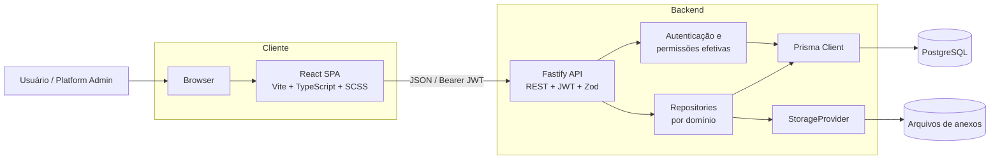

## 2. Monorepo e camadas

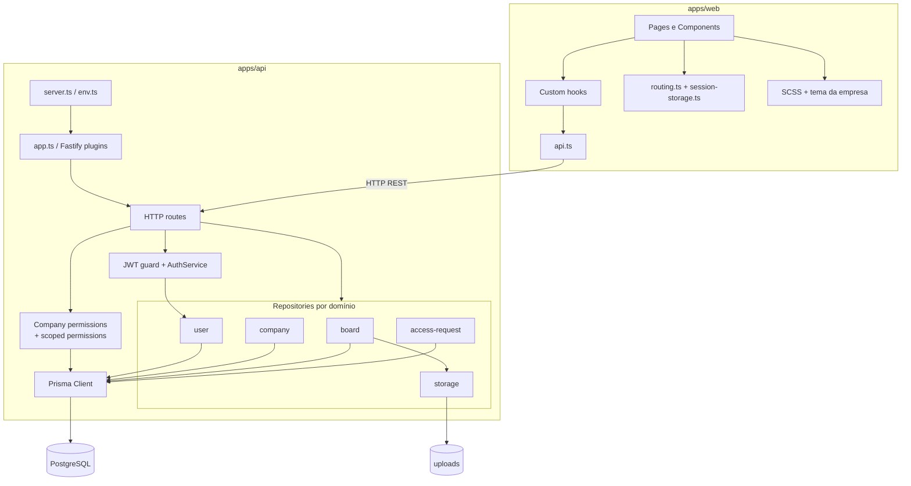

| Camada | Responsabilidade principal |
| --- | --- |
| Components | Renderização, formulários e eventos de UI |
| Hooks | Estado remoto e orquestração das ações do frontend |
| `api.ts` | Contratos HTTP, headers, payloads e parsing de respostas |
| Routes | Autenticação, validação Zod e mapeamento HTTP |
| Services | Orquestração de regras quando há fluxo além da persistência |
| Permission helpers | Resolução de permissões globais e por escopo |
| Repositories | Regras de domínio, queries, transactions e persistência |
| Prisma | Acesso tipado ao PostgreSQL |
| StorageProvider | Conteúdo dos anexos |

## 3. Mapa funcional do frontend

```mermaid
flowchart TB
  app[App.tsx<br/>orquestração raiz]

  app --> authPage[AuthPage]
  app --> adminPage[AdminCompaniesPage]
  app --> workspacePage[CompanyWorkspacePage]
  app --> boardPage[BoardPage]
  app --> profilePage[ProfilePage]
  app --> taskDialog[TaskDetailDialog]
  app --> header[WorkspaceHeader]

  workspacePage --> members[CompanyMembersPanel]
  boardPage --> column[KanbanColumnView]
  boardPage --> createTask[CreateTaskDialog]
  boardPage --> organizer[ColumnOrganizerDialog]
  taskDialog --> comments[TaskComments]
  taskDialog --> attachments[TaskAttachments]
  taskDialog --> activities[TaskActivities]
  taskDialog --> watchers[TaskWatchers]

  app --> navigation[useAppNavigation]
  app --> workspaceData[useWorkspaceData]
  app --> structure[useWorkspaceStructureActions]
  app --> boardActions[useBoardActions]
  app --> memberActions[useCompanyMembersManagement]
  app --> taskHooks[Comments / Attachments<br/>Activities / Watchers hooks]
  app --> companyTheme[useCompanyTheme]

  navigation --> apiClient[api.ts]
  workspaceData --> apiClient
  structure --> apiClient
  boardActions --> apiClient
  memberActions --> apiClient
  taskHooks --> apiClient
```

## 4. Mapa funcional da API

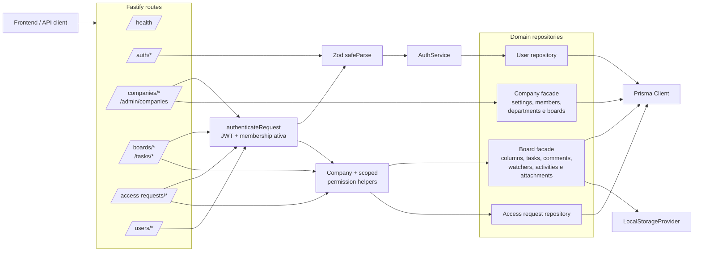

## 5. Autenticação e autorização

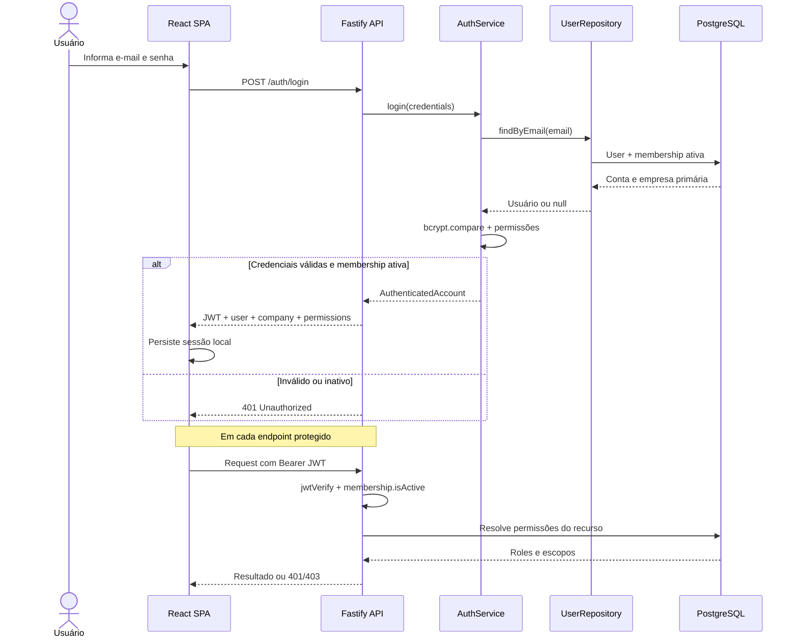

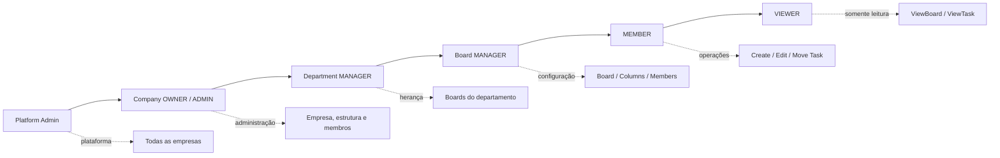

## 6. Ciclo de uma task

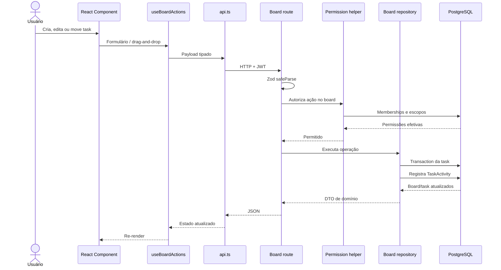

Regras centrais:

- nova task entra somente na primeira coluna;
- `friendlyId` e sequência são únicos dentro do board;
- somente membros ativos podem receber tasks;
- mutations exigem permissão efetiva no escopo;
- comentários, watchers, anexos e mudanças relevantes possuem histórico;
- conteúdo do anexo fica no storage e metadados ficam no PostgreSQL.

## 7. Modelo de dados completo

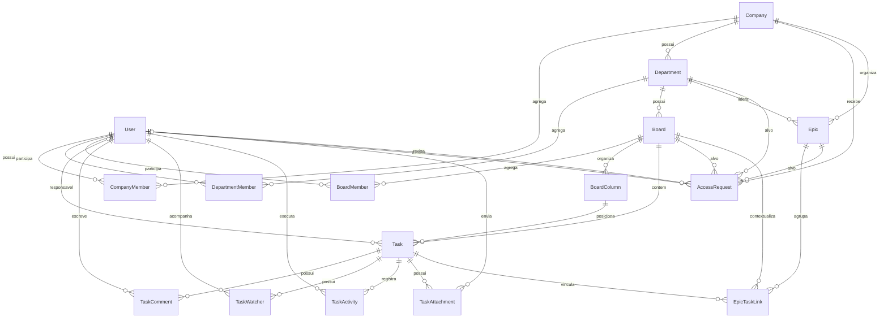

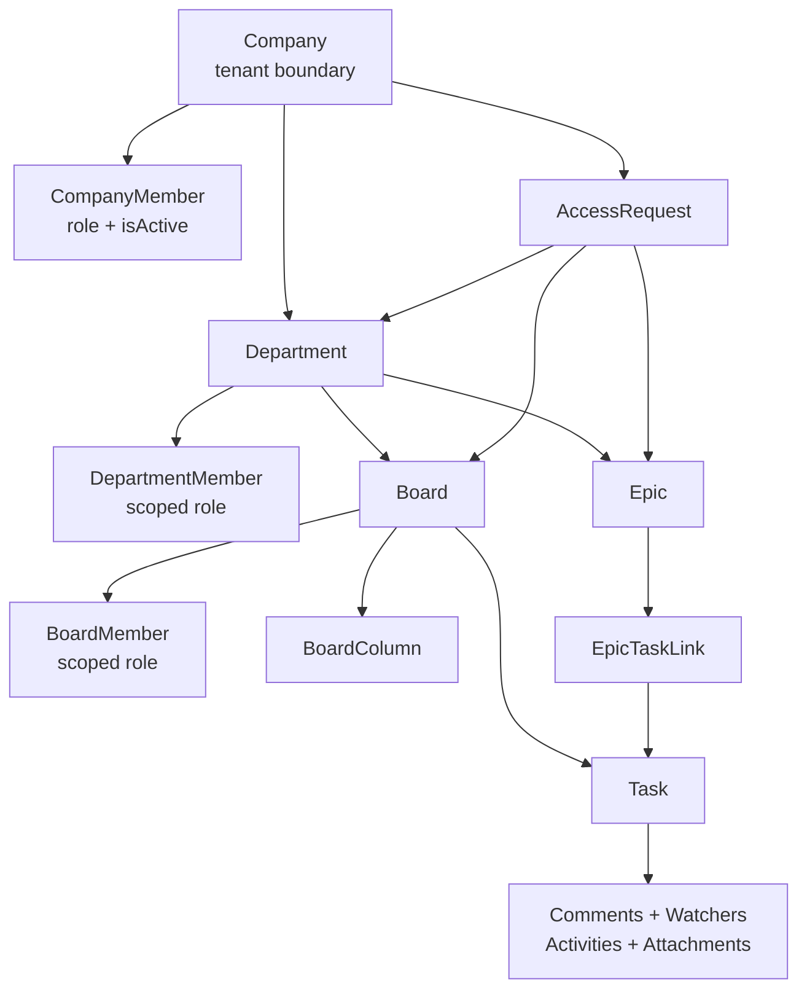

## 8. Deployment com Docker Compose

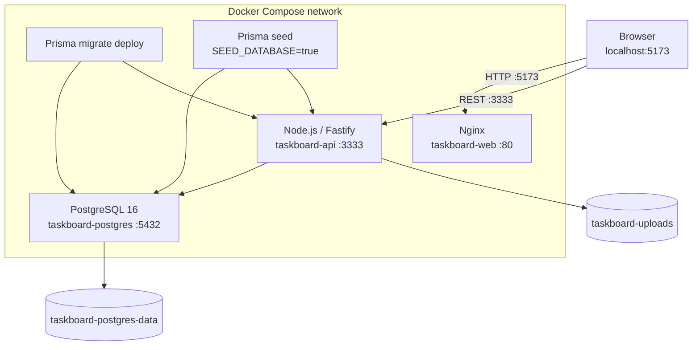

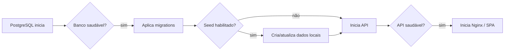

## 9. Estado atual e evolução prevista

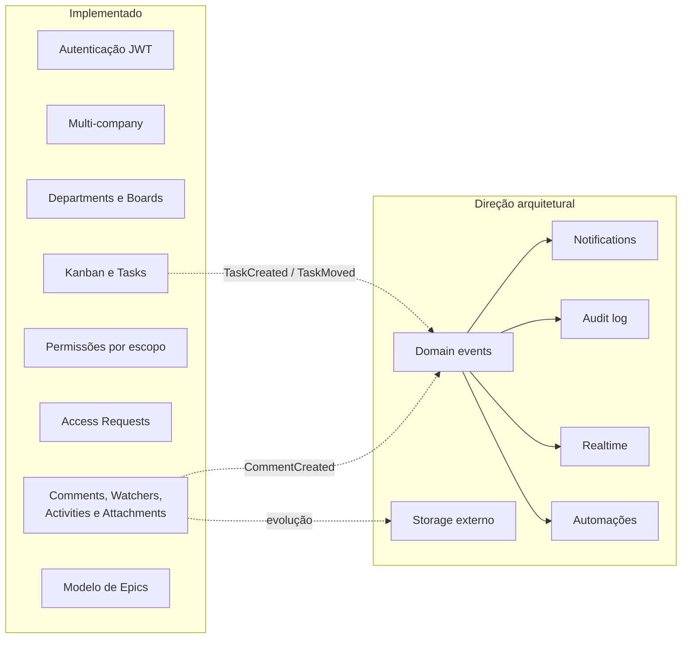

> “Direção arquitetural” representa intenções documentadas e não funcionalidade disponível.

## 10. Fontes de verdade

- Estrutura geral: `docs/architecture.md`
- Modelo de dados: `apps/api/prisma/schema.prisma`
- API: `apps/api/src/app.ts` e `apps/api/src/http/routes/`
- Frontend: `apps/web/src/App.tsx`, `apps/web/src/hooks/` e `apps/web/src/components/`
- Permissões: `docs/permissions.md`, `apps/api/src/permissions.ts` e
  `apps/api/src/scoped-permissions.ts`
- Deployment: `Dockerfile` e `docker-compose.yml`
